# video-strm 用户手册

> 扫描 OpenList 云端目录，为视频生成 `.strm` 下载链接并下载字幕的任务调度工具（本地部署）。
> 本文档按功能模块介绍使用方式，**截图位置已预留**：将截图保存到 `docs/images/` 目录并替换下方 `` 中的文件名即可。

---

## 目录

1. [快速部署](#一快速部署)
2. [全局配置](#二全局配置)
3. [服务器配置](#三服务器配置)
4. [任务配置](#四任务配置)
5. [执行管理](#五执行管理)
6. [实时日志](#六实时日志)
7. [任务历史](#七任务历史)
8. [界面主题](#八界面主题)
9. [常见问题](#九常见问题)
10. [升级与备份](#十升级与备份)

---

## 一、快速部署

使用已发布的 Docker 镜像，无需安装 Python / Node。

```bash
# 创建部署目录并准备 docker-compose.yml（详见仓库 README 或 docker-compose.example.yml）
mkdir video-strm && cd video-strm
# 编写 docker-compose.yml 后启动
docker compose up -d
```

启动后访问 `http://127.0.0.1:8000` 即进入系统首页（五页签：全局配置 / 任务配置 / 执行管理 / 任务历史 / 实时日志）。

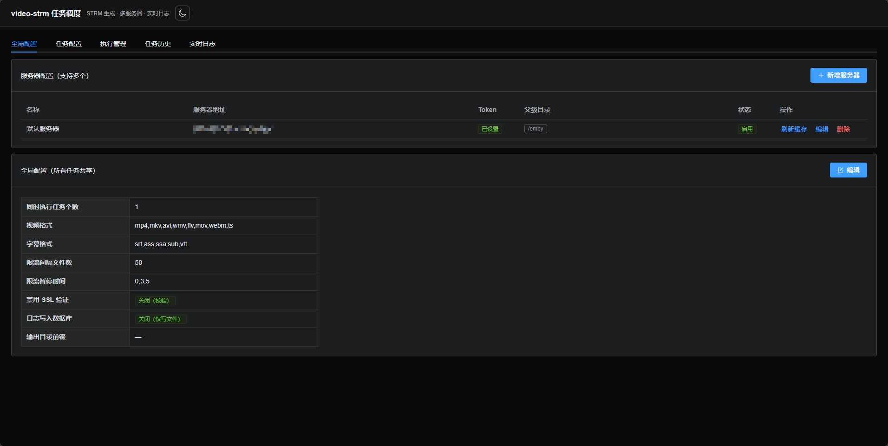

> **首次使用**：系统默认不预置任何服务器，请先进入「全局配置」添加你的 OpenList 服务器（地址 + Token + 父级目录），再创建任务执行。

---

## 二、全局配置

「全局配置」页签包含两块：**服务器配置**（见下一节）与**全局配置**（所有任务共享的参数）。

点击「编辑」可修改：

| 配置项 | 说明 |
|--------|------|
| 同时执行任务个数 | 限制同时运行的任务数量，超出排队等待 |
| 视频格式 | 识别为视频的扩展名（逗号分隔，如 `mp4,mkv,avi`） |
| 字幕格式 | 识别为字幕的扩展名（逗号分隔） |
| 限流间隔文件数 | 每隔 N 个文件暂停一次（对服务器限流） |
| 限流暂停时间 | 暂停秒数，逗号分隔随机取一；填 `0` 不限流 |
| 输出目录前缀 | 快速添加任务配置时拼接到输出目录前（默认空） |
| 禁用 SSL 验证 | 内网自签名 HTTPS 时开启 |
| 日志写入数据库 | 开启后日志双写数据库（默认仅写日志文件） |

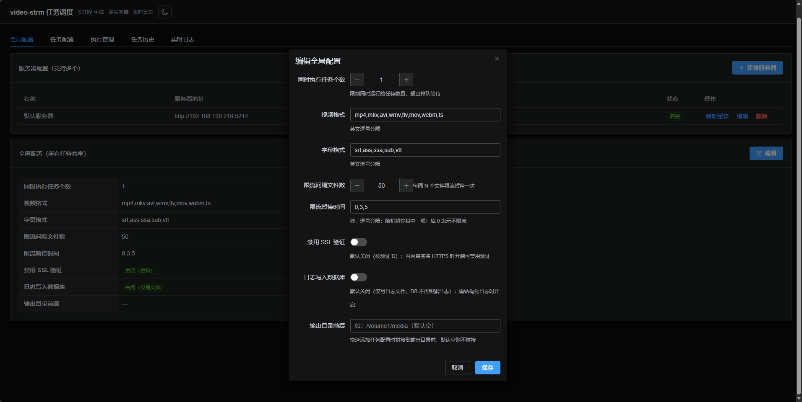

---

## 三、服务器配置

「全局配置」页签上半部分为**服务器配置**，支持多台 OpenList 服务器。

### 新增/编辑服务器

点击「新增服务器」，填写：

- **名称**：可选，便于识别
- **服务器地址**：OpenList/AList API 地址（如 `http://192.168.1.100:5244`）
- **访问 Token**：OpenList 的访问令牌
- **父级目录**：每行一个，**无需手写 `/`**（如 `emby/动漫` 自动存为 `/emby/动漫`）；可配置多个
- **跳过校验**：服务器暂时不可达时可跳过存在性/读写校验（格式校验始终执行）

**保存时自动校验**每个父级目录：路径格式 → 目录是否存在 → 是否具备读写权限；任一失败会阻止保存并提示具体原因。

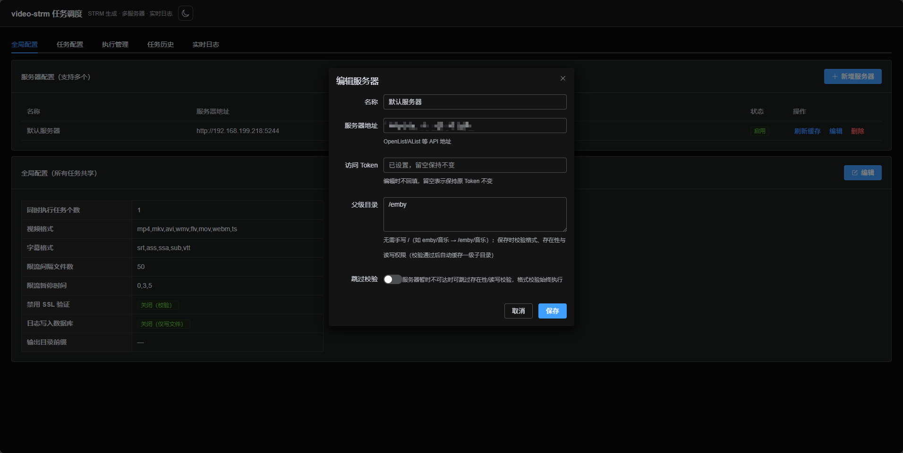

### 目录缓存与刷新

- 校验通过后，系统自动缓存每个父级目录的一级子目录（条目含名称/路径/最后修改时间），执行管理/快速添加时缓存优先、减少服务器请求
- 每台服务器行尾的 **「刷新缓存」** 按钮：手动刷新该服务器全部父级目录的一级缓存

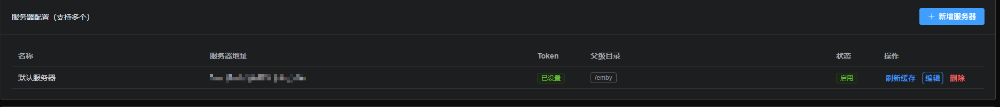

---

## 四、任务配置

「任务配置」页签管理所有任务。**任务强关联服务器**：每个任务必须属于某一台服务器，表格展示服务器地址，并可按服务器筛选。

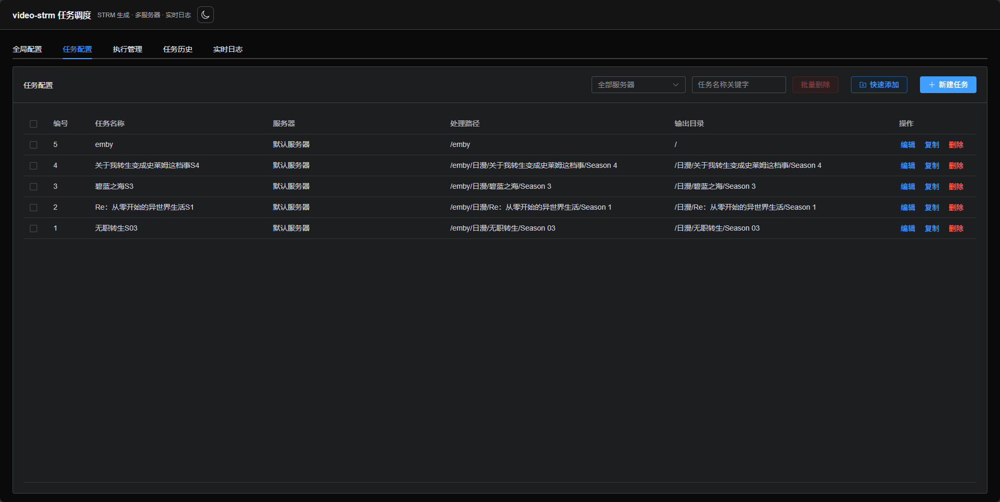

### 手动新建/编辑任务

点击「新建任务」（或行内「编辑」/「复制」），填写：

- **所属服务器**（必选）：任务只能在所属服务器上执行
- **任务名称**
- **处理路径**：云端目录路径（如 `/emby/动漫/日漫`）
- **输出目录**：STRM/字幕落盘目录
- **限流间隔 / 限流暂停**：可留空，留空则使用全局配置

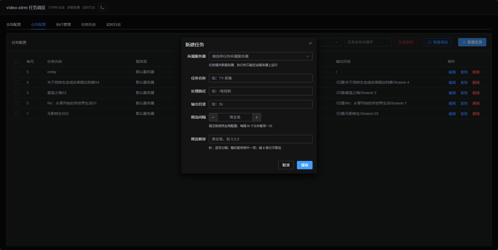

### 快速添加（按目录批量生成）

点击「快速添加」，在右侧抽屉中：

1. **选择服务器** → 自动带出其父级目录
2. **父级目录**：下拉选择；没有想要的父级目录可点 **「新增」** 直接添加（校验后自动缓存并选中）
3. **目录树**：从父级目录开始逐层展开勾选目录（可多选、任意层级单独勾选）
4. **搜索**：输入关键字模糊搜索**已加载的缓存目录**；结果项可点 **「进入」** 继续下钻浏览其子目录并选择
5. **「刷新缓存」**：递归刷新当前父级目录下**所有层级**的目录缓存
6. 选项：
   - **同时把父级目录本身作为一条任务配置**（其输出目录为 `/`，表示父级作为根）
   - **输出目录带父级目录**：选中以父级目录开头（如 `/emby/电视剧`），不选以一级子目录开头（如 `/电视剧`）
   - **限流间隔 / 限流暂停**：可留空用全局
7. **添加预览**：确认每条任务（任务名/处理路径/输出目录），可单独 **删除**（同步取消树勾选）
8. 点击 **「添加 N 条任务配置」** 批量创建

> 季文件夹（`Season 01` / `S01` / `Season 1` 等）自动命名为「上级文件夹名S季号」，如 `美剧/Season 01` → 任务名 `美剧S01`。


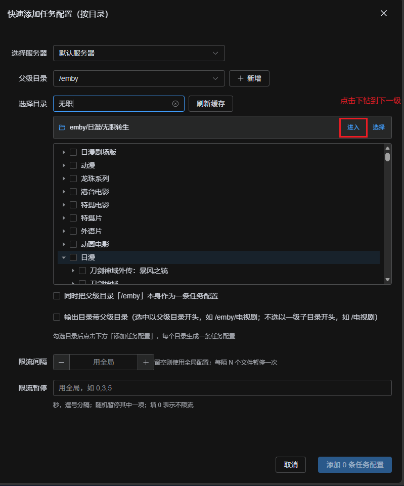
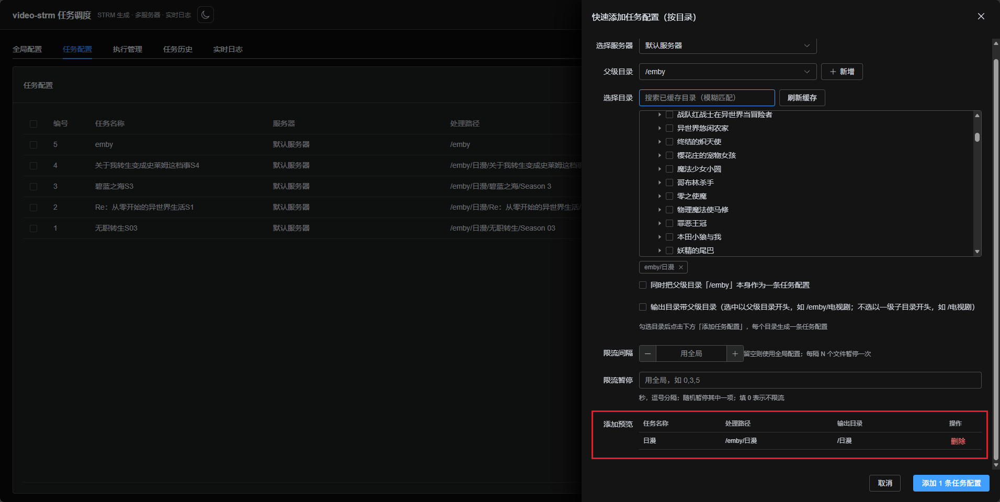

---

## 五、执行管理

「执行管理」页签用于批量执行任务。

1. **选择服务器**：下拉选择（只列启用中的服务器）
2. **选择任务**：**仅展示所选服务器的任务**（强关联），可多选、关键字过滤，运行中的任务置灰
3. 执行选项：
   - **增量更新**：默认开启，跳过已存在的 STRM/字幕
   - **强制生成**：开启后重新生成全部；可再勾选 **仅更新 strm**（不重下已存在字幕）
4. 点击 **「执行任务」** → 自动跳转「实时日志」页
5. **取消任务**：选中正在执行的任务后可取消

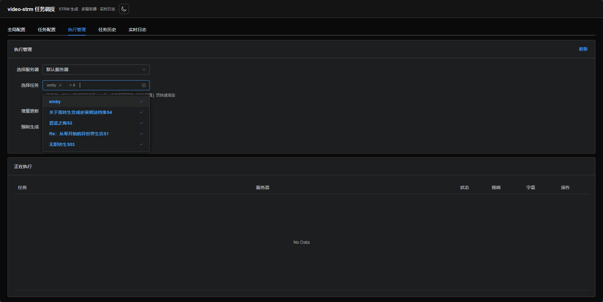

---

## 六、实时日志

执行后自动进入「实时日志」页，WebSocket 实时推送日志与进度：

- 多任务批量执行时，顶部下拉可**切换查看**各任务的日志
- 展示视频/字幕处理进度（成功/总数）
- 任务完成后可前往「任务历史」查看回放与下载

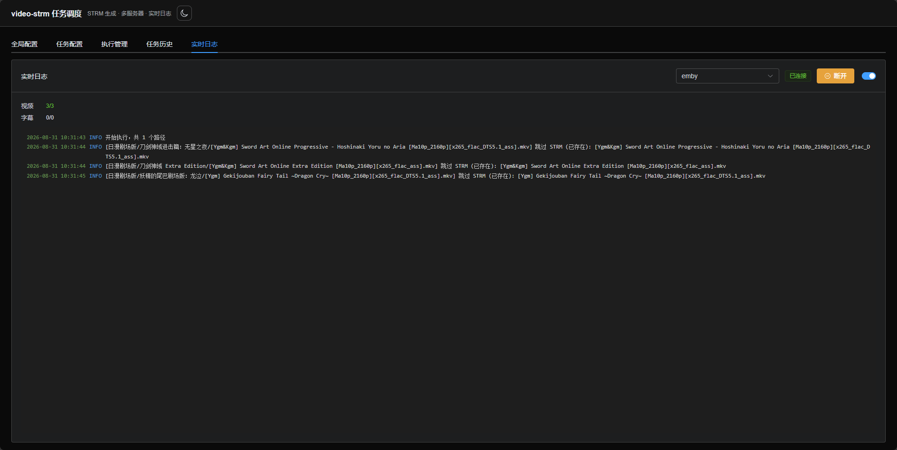

---

## 七、任务历史

「任务历史」页签：

- **列表**：每个任务最近一次执行，可按**服务器筛选**；展示任务名称、处理路径、服务器、状态、视频/字幕数、耗时、执行时间
- **详情页**：点击任务名或「详情」进入**独立页面**，展示该任务全部执行记录（处理路径/输出目录/状态/进度/耗时），支持分页
- 每条记录可 **查看日志**（回放）与 **下载日志文件**

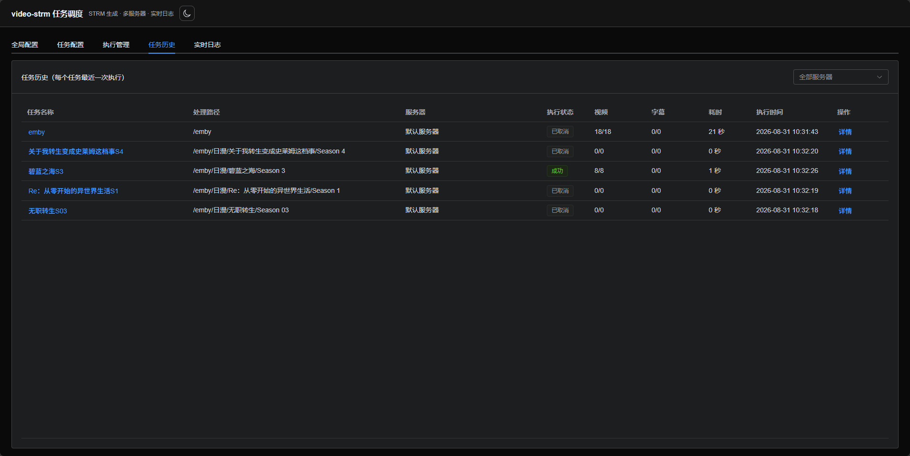
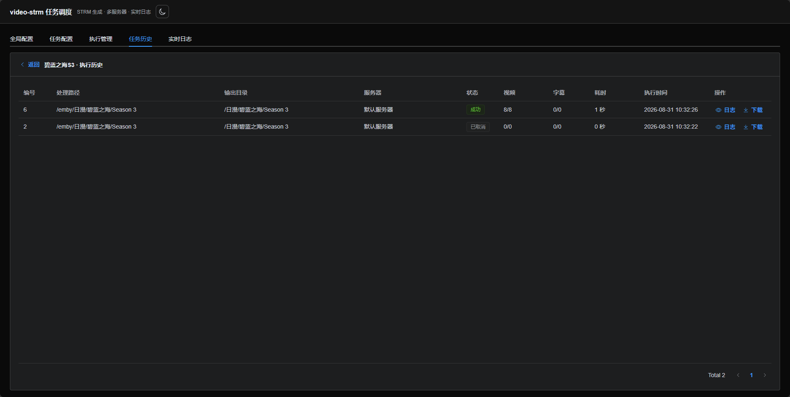

---

## 八、界面主题

右上角主题按钮支持 **浅色 / 深色 / 跟随系统** 三种模式，选择自动记忆（localStorage），刷新不闪白。

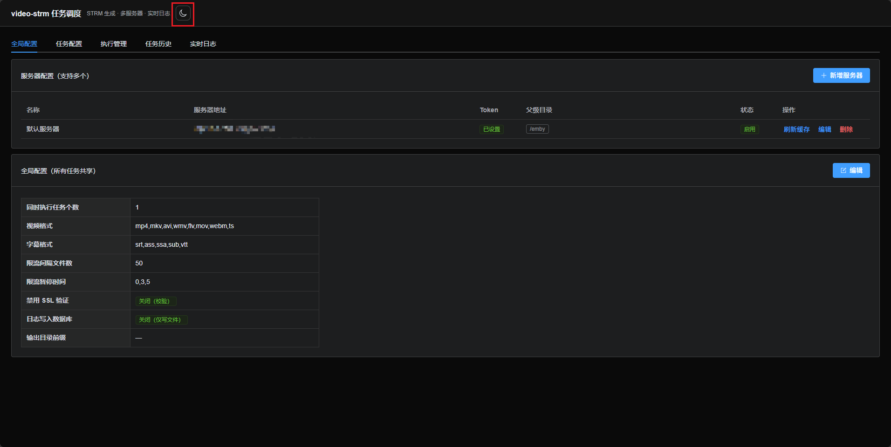

---

## 九、常见问题

| 问题 | 处理 |
|------|------|
| 添加服务器提示「目录校验失败」 | 检查父级目录是否真实存在、Token 是否有权限；服务器不可达时可勾选「跳过校验」保存 |
| 执行提示「任务与所选服务器不匹配」 | 任务强关联服务器，请切换到任务所属服务器执行 |
| 快速添加没有目录展示 | 确认服务器已配置父级目录；未配置可在快速添加里点「新增」添加 |
| 搜索不到目录 | 搜索范围是**已加载（已缓存）**的目录：先在目录树展开对应层级，或点「刷新缓存」后再搜 |
| 生成的文件属主是 root | 容器以 root 运行，映射目录内文件属主为 uid 0，与媒体库共用目录时注意权限 |
| 端口被占用 | 修改 docker-compose 的 `ports` 映射并重启 |

---

## 十、升级与备份

**升级**

```bash
docker compose pull && docker compose up -d
```

**备份**（数据都在映射目录中）

```bash
# 停容器后备份（或直接复制）
tar -czf video-strm-backup.tar.gz data openlist_logs
```

- `data/`：SQLite 数据库（服务器/任务/执行记录等全部配置与历史）
- `openlist_logs/`：执行日志文件
- `output/`：生成的 STRM/字幕文件
